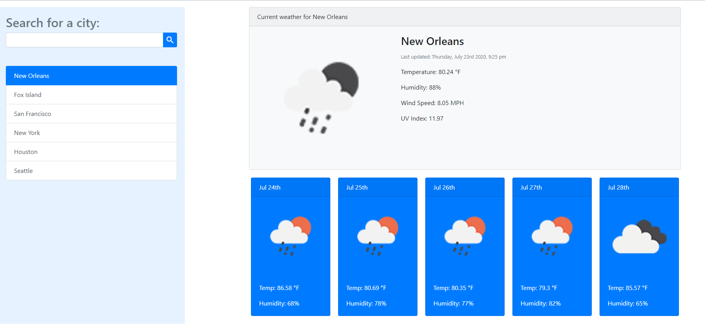

# WeatherDashboard

WeatherDashboard is a simple weather application. It has a search functionality to find current weather conditions and the future weather outlook for multiple cities. It uses the OpenWeather API to retrieve weather data for cities. The app uses AJAX to hook into the API to retrieve data in JSON format. It runs in the browser and features dynamically updated HTML and CSS powered by jQuery. It includes a search history so that users can access their past search terms. Clicking on the city name performs a new search that returns current and future conditions for that city.

Displays the following under current weather conditions:
  - City
  - Date
  - Icon image (visual representation of weather conditions)
  - Temperature
  - Humidity
  - Wind speed
  - UV index

Includes a 5-Day Forecast below the current weather conditions. Each day for the 5-Day Forecast displays the following:
  - Date
  - Icon image (visual representation of weather conditions)
  - Temperature
  - Humidity
  
  https://atollett.github.io/WeatherDashboard/

